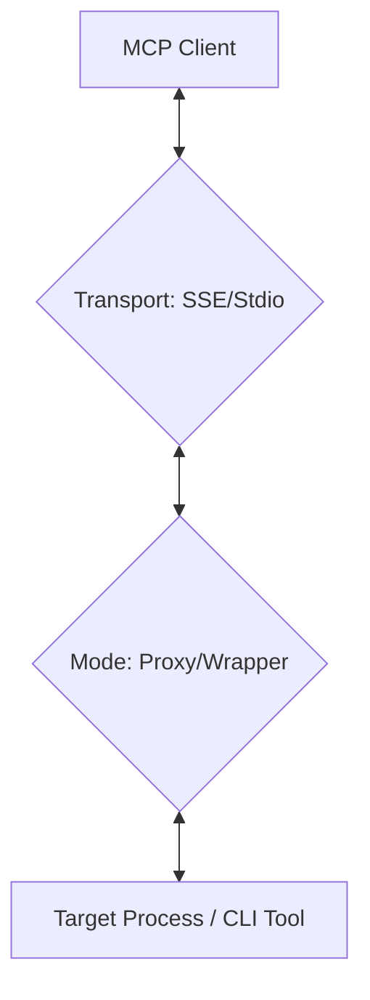

# System Architecture

The **MCP Stdio Bridge** is designed as a highly modular and extensible gateway for the Model Context Protocol (MCP). It provides a bridge between different transport protocols (SSE and Stdio) and operational modes (Proxy and Command-Wrapper).

## Overview

The core responsibility of the bridge is to facilitate JSON-RPC message exchange between an MCP client (such as Claude Desktop or a remote SSE client) and a backend tool or server.

### Modular Structure

The project follows a modular package layout in `src/mcp_stdio_bridge/`:

-   **`main.py`**: The application entry point. Coordinates initialization, configuration loading, and starts the selected transport.
-   **`config.py`**: Manages application settings with a strict hierarchy (CLI > Environment > Local YAML > Home YAML > Defaults).
-   **`logging_utils.py`**: Configures the unified logging subsystem, optimized for non-corruption of Stdio streams.
-   **`middleware.py`**: Custom Starlette middleware for security (API Key, Secure Headers).
-   **`transport/`**: Contains transport-specific implementations:
    -   `sse.py`: HTTP/SSE server using Starlette and Uvicorn.
    -   `stdio.py`: Standard I/O bridge for local client integration.
-   **`mode/`**: Contains operational logic for the two bridging modes:
    -   `proxy.py`: Low-level bidirectional stream bridging between an external process and a transport.
    -   `wrapper.py`: An internal MCP server that dynamically wraps standard CLI tools as MCP tools.

## Transport Interactions

The bridge decouples **how** messages are transported from **what** happens to them:

1.  **SSE Transport**: Listens for HTTP GET requests to establish an EventSource stream.
2.  **Stdio Transport**: Connects directly to the process's `stdin`/`stdout`.

Both transports then hand off the raw read/write streams to either the **Proxy** or **Wrapper** logic.

## Operation Modes

### 1. Proxy Mode
In this mode, the bridge is transparent. It spawns a separate instance of a configured MCP server for every connection. JSON-RPC messages are forwarded bit-for-bit, allowing the bridge to act as an authenticated, secure gateway for existing servers.

### 2. Command-Wrapper Mode
In this mode, the bridge hosts an internal MCP server. It maps individual subcommands of standard CLI tools (like `git`, `ls`, or `wp-cli`) to MCP tools. When a tool is called, the bridge spawns the tool, captures its output, and returns it as an MCP `TextContent` response. It supports tool-specific **environment variable merging** and **path sanitization**.

## Data Flow Diagram

